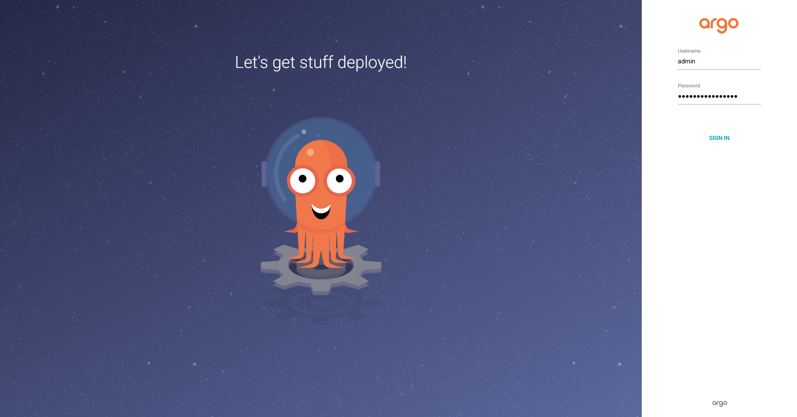
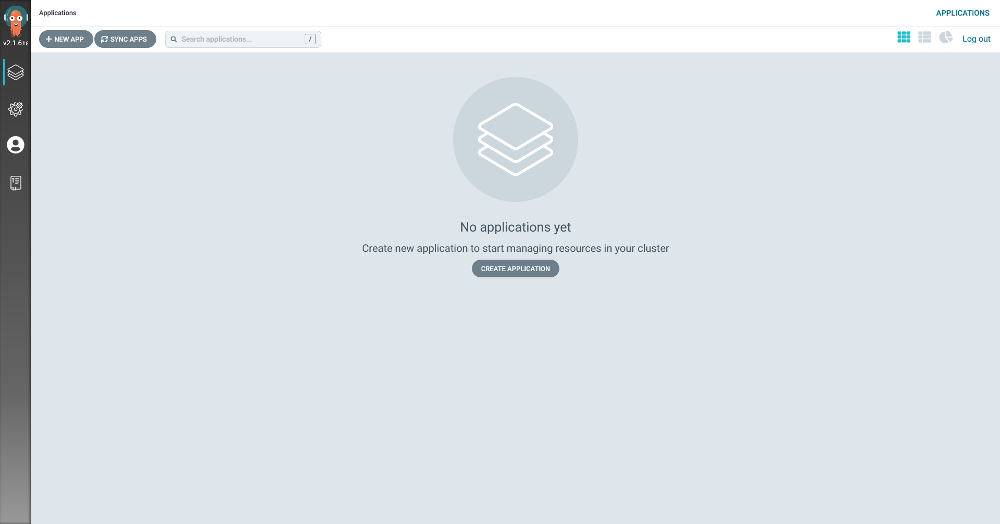

Set up Helm repository to install Argo CD in Kubernetes.
First, add Argo Helm repository by executing following command:

`helm repo add argo https://argoproj.github.io/argo-helm`{{execute}}

Then update repository information in the local environment by executing following command:

`helm repo update`{{execute}}

Install Argo CD by executing following command:

`helm install argocd argo/argo-cd`{{execute}}

Installing takes minutes.
Execute following command until the pod status shows up `Running`:

`kubectl get po -l app.kubernetes.io/name=argocd-server`{{execute}}

Argo CD creates initial admin account which name is `admin`.
Get its password by executing following command:

`kubectl -n default get secret argocd-initial-admin-secret -o jsonpath="{.data.password}" | base64 -d; echo`{{execute}}

Forward the environment's port to access Argo CD's Web UI by executing following command:

`kubectl port-forward svc/argocd-server 443:443 --address 0.0.0.0 &> /dev/null &`{{execute}}

Open `ArgoCD Dashboard` tab and log in as `admin`.

You can see no applications in the dashboard.

Next, create your own Git repository to push your own deployment configuration.
