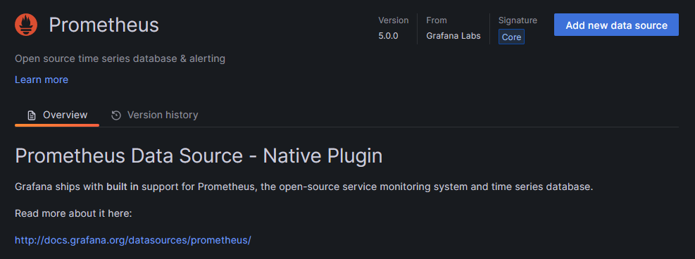
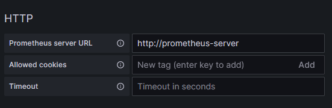
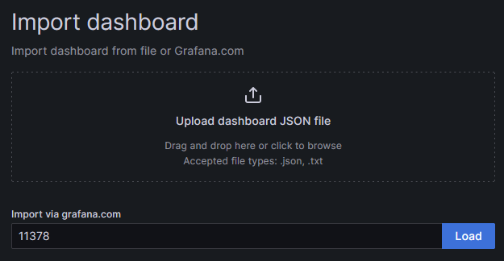
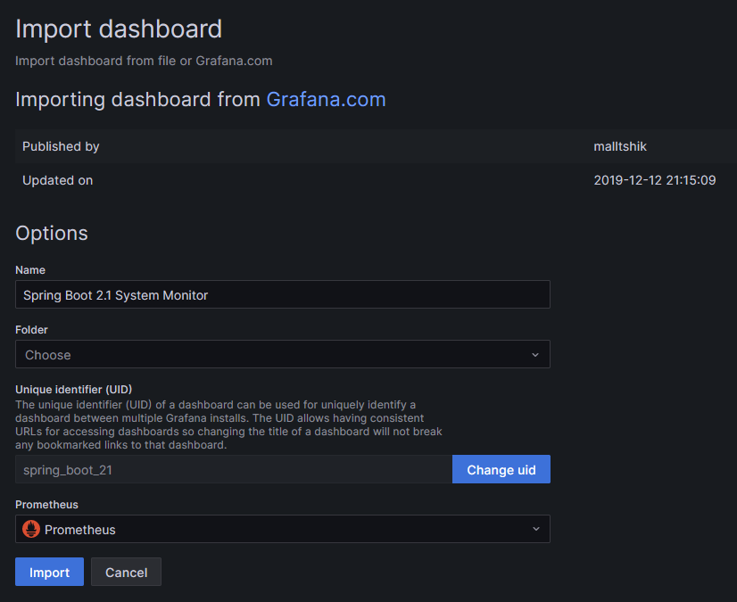
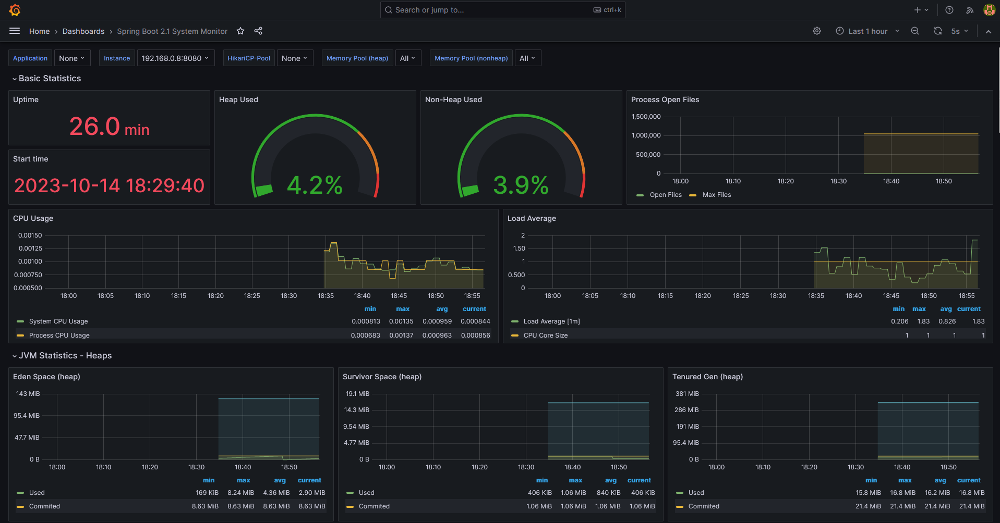

[Click here]({{TRAFFIC_HOST1_3000}}/connections/datasources/prometheus) to add a Prometheus datasource to Grafana.

Click `Add new data source` button

and input `http://prometheus-server` in `HTTP > Prometheus server URL`,

and click `Save & test` button at the end of the page.

[Click here]({{TRAFFIC_HOST1_3000}}/dashboard/import) to add a dashboard to Grafana.

Input `11378` in `Import via grafana.com`

and click `Load` button.

Select Prometheus data source from the pull down list, and click `Import` button.

You can see a dashboard.

